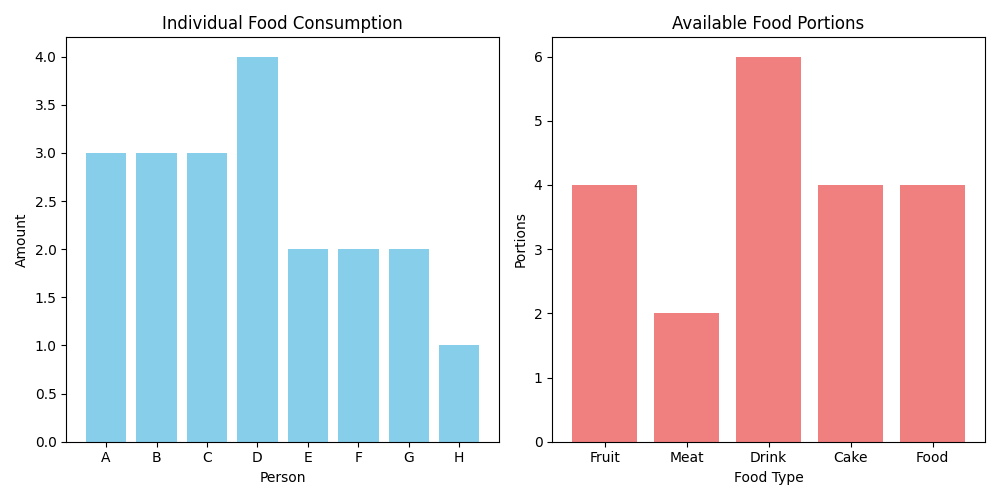

# Sea's Party

某天，大海要举办一场聚会，邀请了八个人，分别是$A,B,C,D,E,F,G,H, Number=8$，大海为他们准备了五种食物，分别是$Fruit,Meat,Drink,Cake,Food,Number=5$。大海有火眼金睛，能够轻而易举看透每个人的食量，分别是$\mathbf{r} = (3, 3, 3, 4, 2, 2, 2, 1)^\top \in \mathbb{R}^n$ ，其中$\mathbf{r}_i$表示第$i$个人的食量。大海食物准备的不够充足，用 $\mathbf{c} = (4, 2, 6, 4, 4)^\top \in \mathbb{R}^m$ 来代表每个小吃的份数，其中$\mathbf{c}_j$表示第$j$种食物的份数。

同时，大海可以看到每个人人对各类食物的喜爱程度，如下表所示，+2表示最喜欢，-2表示最讨厌，0表示无感。

|            | Fruit | Meat | Drink | Cake | Food |
|------------|-------------|--------|------------------|----------|--------------|
| A    | 2           | 2      | 1                | 0        | 0            |
| B        | 0           | -2     | -2               | -2       | 2            |
| C     | 1           | 2      | 2                | 2        | -1           |
| D      | 2           | 1      | 0                | 1        | -1           |
| E    | 0.5         | 2      | 2                | 1        | 0            |
| F    | 0           | 1      | 1                | 1        | -1           |
| G        | -2          | 2      | 2                | 1        | 1            |
| H     | 2           | 1      | 2                | 1        | -1           |

接下来问题来了, 大海要如何分配食物, 从而保证在所有人都吃饱, 且所有食物都被分完的前提下, 每个人都尽可能吃到自己最喜欢吃的食物呢?

## 1.1 Optimal Transport

如你所见，上面的问题就是一个经典的最优传输问题。最优传输问题（Optimal Transport Problem）是数学和运筹学中一个重要的研究领域，它研究的是如何以最小的代价将一个分布转移到另一个分布。最优传输问题最早由法国数学家朱利叶斯·亨利·庞加莱（Jules Henri Poincaré）在19世纪末提出，后来被广泛应用于经济学、物理学、计算机科学等领域。

回顾前文，我们用$\mathbf{r} \in \mathbb{R}^n$表示每个人对食物的食量，用$\mathbf{c} \in \mathbb{R}^m$表示每种食物的份数，则我们的目标是求解一个维度为$n \times m$的矩阵$\mathbf{P} \in \mathbb{R}^{n \times m}$，使得$\mathbf{P}_{ij}$表示第$i$个人吃第$j$种食物的份数。把每个人对食物的喜好矩阵取反后得到代价矩阵（cost matrix）记为$\mathbf{M} \in \mathbb{R}^{n \times m}$，则最优传输问题可以表示为：
$$
\begin{aligned}
\mathbf{d}_{\mathbf{M}}(\mathbf{r}, \mathbf{c}) = \min_{\mathbf{P} \geq 0} \quad & \sum_{i,j} \mathbf{P}_{ij} \cdot \mathbf{M}_{ij} \\\\
\text{s.t.} \quad & \mathbf{P} \mathbf{1}_m = \mathbf{r} \quad \text{（按行求和，匹配每个人的食量）} \\\\
& \mathbf{P}^\top \mathbf{1}_n = \mathbf{c} \quad \text{（按列求和，匹配每种食物的总量）}
\end{aligned}
$$
其中$\mathbf{1}_n$和$\mathbf{1}_m$分别表示维度为$n$和$m$的全1向量。
这就被称之为$\mathbf{r}$和$\mathbf{c}$之间的**Optimal Transport Problem**，其中$\mathbf{d}_{\mathbf{M}}(\mathbf{r}, \mathbf{c})$表示最优传输问题的最优值，$\mathbf{P}$表示最优传输问题的最优解。注意，目标函数和限制函数都是线形的，所以这个最优传输问题可以被闲心规划有效求解。其中，该问题的最优解$\mathbf{d}_{M}(\mathbf{r}, \mathbf{c})$也被称之为$Wasserstein$ $distance$，当$(\mathbf{r}, \mathbf{c})$都是概率分布时，$Wasserstein$ $distance$便是这两个分布之间的就的一种度量。

Optimal Transport 有时候也被称为 *earth mover distance*，因为当你把 $\mathbf{r}$、$\mathbf{c}$ 想象成两座小沙丘时，$\mathbf{P}^*_{ij}$ 实际描述了你要怎么搬运沙子，从而以最小的代价让 $\mathbf{r}$ 变成 $\mathbf{c}$。  
举例：

|       | 0.2 | 0.6 | 0.2 |
|-------|-----|-----|-----|
| 0.6   | 0   | 0.6 | 0   |
| 0.4   | 0.2 | 0   | 0.2 |

假设 $\mathbf{r} = (0.6, 0.4)^\top$，$\mathbf{c} = (0.2, 0.6, 0.2)^\top$，我们先不考虑代价矩阵 $\mathbf{M}$。上表就描述了一种搬运方式：即把 $\mathbf{r}$ 的第一堆沙子全搬到 $\mathbf{c}$ 的第二堆，把 $\mathbf{r}$ 的第二堆沙子平均搬到 $\mathbf{c}$ 的第一堆和第三堆。

关于引言部分我们就介绍到这里，所以最优传输是你曾经在生活中就已经发现的问题，只不过当时你没有意识到，下一章节我们将正式开始最优传输的学习。